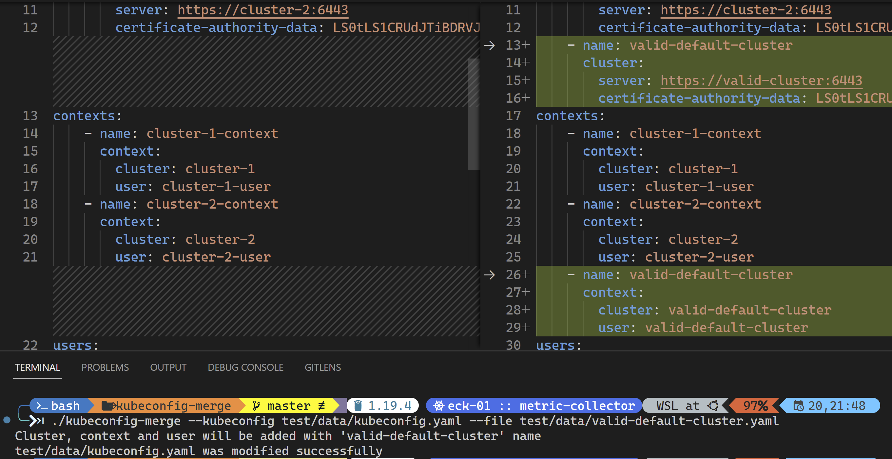

---

# 🌟 kubeconfig-merge

`kubeconfig-merge` is a lightweight and efficient CLI tool designed to **merge multiple Kubernetes `kubeconfig` files** into a single, well-structured configuration. It ensures that the resulting configuration is clean, free of conflicts, and compatible with `kubectl` and other Kubernetes clients.

## 🚀 Features

✔ **Merge multiple `kubeconfig` files** into one unified configuration  
✔ **Preserve existing contexts, clusters, and users** without conflicts  
✔ **Ensure a clean and well-structured config file**  
✔ **Works seamlessly with `kubectl` and Kubernetes clients**  
✔ **Lightweight, fast, and easy to use**  

## 📌 Installation

### Install on Linux

The following instruction list covers all of the Linux distributions (Ubuntu, Debian, Redhat, CentOS, RHEL, etc.) that provide `sh` as an executable:

```bash
(
    set -x
    EXEC_PATH="/usr/local/bin/kubeconfig-merge"
    cd "$(mktemp -d)" &&
        OS="$(uname | tr '[:upper:]' '[:lower:]')" &&
        ARCH="$(uname -m | sed -e 's/x86_64/amd64/' -e 's/\(arm\)\(64\)\?.*/\1\2/' -e 's/aarch64$/arm64/')" &&
        FILENAME="kubeconfig-merge_${OS}_${ARCH}" &&
        curl -fsSLO "https://github.com/btungut/kubeconfig-merge/releases/latest/download/${FILENAME}" &&
        sudo rm -rf "$EXEC_PATH" && sudo cp "${FILENAME}" "$EXEC_PATH" && sudo chmod +x "$EXEC_PATH"
)   
```

### Install on Windows
TBD


## Arguments

| Argument   | Type    | Description                                     | Default                                        |
| ---------- | ------- | ----------------------------------------------- | ---------------------------------------------- |
| kubeconfig | string  | The kubeconfig file which to be append into     | `KUBECONFIG` env variable, or `~/.kube/config` |
| file       | string  | To be appended kubeconfig file                  | **Required**                                   |
| override   | boolean | Use file name for the cluster, context and user | Optional                                       |


## Examples


### `./kubeconfig-merge --file valid-default-cluster.yaml`

