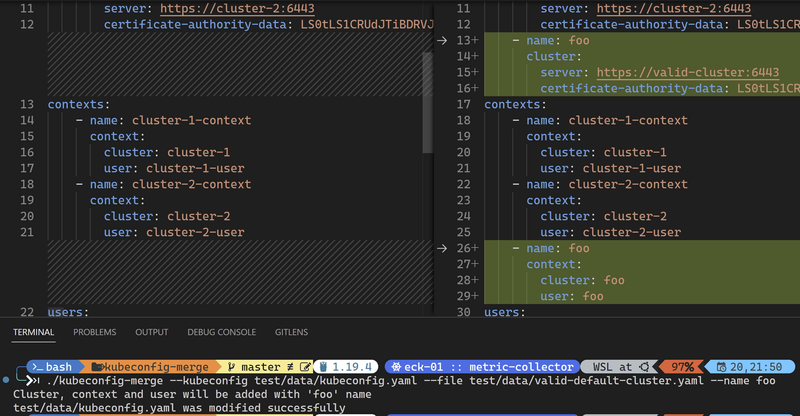

# `kubeconfig-merge`: Painless and faultless way to merge kubeconfig files

## Arguments

| Argument     | Description                                                                | Default                                        |
|--------------|----------------------------------------------------------------------------|------------------------------------------------|
| file       | The additional kubeconfig file | *Required* |
| kubeconfig | The kubeconfig file which to be append into        | `KUBECONFIG` env variable, or `~/.kube/config` |
| name       | Context, cluster and user name of new entries                              | File name of `--file`|

## Examples

---
### `./kubeconfig-merge --file valid-default-cluster.yaml`

 

---

### `./kubeconfig-merge --file valid-default-cluster.yaml --name foo`
